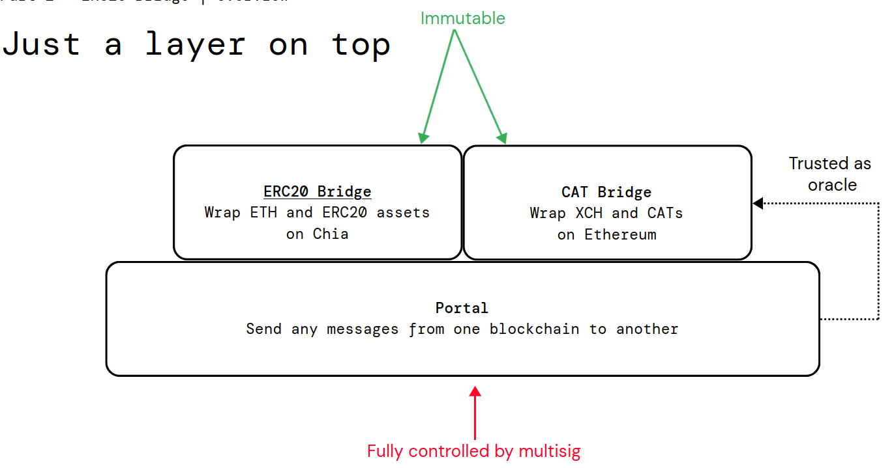

# Collecting Signatures

<figure><figcaption>
Overview of the overall infrastructure. The app is generally responsible for building, initiating, and submitting all transactions. Each validator has an associated Nostr account where they post signatures. At launch, each validator is also responsible for maintaining a private Nostr relay that the browser can connect to.
</figcaption></figure>

<figure><figcaption>
Validators generally send their text note event to all private relays. If the Nostr server of a validator goes down but the signer is still working, it will still be possible for a user to fetch the validator's signature.
</figcaption></figure>

A signature is comprised of:

* R[^1]outing data: source chain id, destination chain id, and nonce. Binary data is concatenated, and the result is bech32m-encodeded with a prefix of 'r'
* Coin data (optional): singleton coin id for which the signature is valid, bech32m-encoded with a prefix of 'c'. Only used if destination chain is Chia ('xch').
* Signature data: signature, bech32m-encoded with a prefix of 's'

Each validator has an associated Nostr public key ('account') where signatures are posted as kind 1 events (short text note). The signature data is used as the content, while routing and coin data are put in tags with keys 'r' and 'c', respectively. To relay a message, apps should first connect to Nostr relays and fetch the required number of signatures.

[^1]: 
